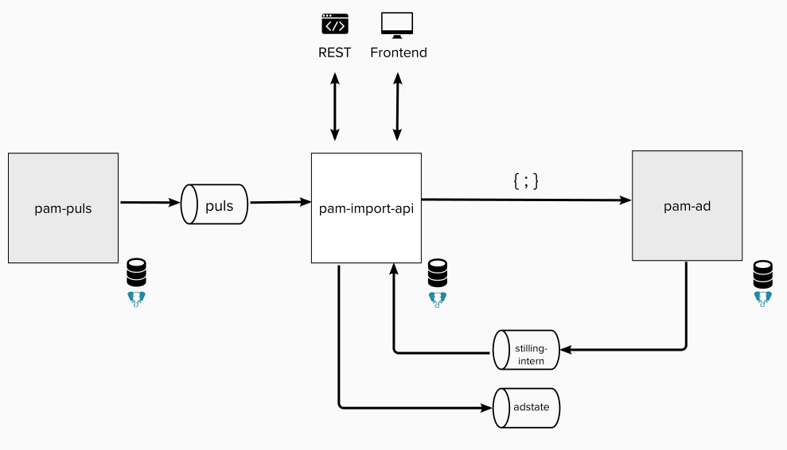

## Beskrivelse

pam-import-api er en applikasjon som lar stillingsleverandærer laste opp og publisere stillingsannonser
på [arbeidsplassen.nav.no](https://arbeidsplassen.nav.no/).

# Technical documentation

## Technologies

* Kotlin
* Micronaut
* Postgres
* Kafka

## Environment

The image below shows a simplified sketch of pam-import-api and its internal integrations.



### REST API

Providers can upload, publish and retrieve information about job ads through a REST API.

Information about the API is provided in the [API documentation](https://navikt.github.io/pam-import-api/).

### Postgres DB

The app uses a Postgres database to store different information about providers and ads.

### Integration with pam-ad

[navikt/pam-ad](https://github.com/navikt/pam-ad) consumes ads published through pam-import-api as a JSON feed.
pam-ad
stores the ad master data. (**Note:** The JSON feed will be replaced by Kafka in the future. pam-import-api is
prepared to send ad information to the Kafka topic `adstate`, but consumption is not yet implemented in pam-ad.)

pam-ad sends information about ad changes to the Kafka topic `stilling-intern` that pam-import-api listens to.

### Integration with pam-puls

[navikt/pam-puls](https://github.com/navikt/pam-puls) stores information about ad statistics and sends the
information to the Kafka topic `puls` that pam-import-api listens to.

# Secrets

All secrets are now available in the Nais console. There are three of them:

* pam-import-api-script-secret is not used by the application, but should be used by developers when they need to use
  the provider-scripts
* import-api-dev-key contains information about a provider in dev that developers can use to test the API.
* pam-import-api-env-secret contains the JWT secret needed to verify tokens sent in. This is the only secret used by the
  application.

## pam-import-api-env-env-secret

This secret is read using envFrom in naiserator.yml
The secret contains both the JWT_SECRET and a username and password for a service user. I think the latter is not used.

# Getting started

## Build and run

```
./gradlew clean build
./gradlew run
```

## Run Kafka and Postgres with docker-compose

```
docker-compose up --build
```

### Kafka

Running with Kafka in tests, you need to add these system properties:

```
KAFKA_BOOTSTRAP_SERVERS=host1:port,host2:port
KAFKA_SSL_TRUSTSTORE_LOCATION=truststore
KAFKA_SSL_TRUSTSTORE_PASSWORD=truststorepassword
KAFKA_SASL_MECHANISME=PLAIN
KAFKA_SASL_JAAS_CONFIG='org.apache.kafka.common.security.plain.PlainLoginModule required username=kafka password=password;'
KAFKA_SECURITY_PROTOKOL=SASL_SSL
```

### Creating new provider in test

```
curl -k -XPOST -H "Accept: application/json" -H "Cache-Control: no-cache" -H "Content-Type: application/json" -d '{"identifier":"jobnorge-test","email":"test@jobnorge.no", "phone":"12345678"}' https://pam-import-api.nais.oera-q.local/stillingsimport/internal/providers
```

# Register new providers

Providers must authenticate requests to the API with a `providerId` and `token`. These credentials are generated
manually with scripts in this
app ([register-new-provider.sh](https://github.com/navikt/pam-import-api/blob/master/scripts/register-new-provider.sh)
and [generate-provider-tokens.sh](https://github.com/navikt/pam-import-api/blob/master/scripts/generate-provider-tokens.sh)).

## Prerequisites

Providers must register themselves as a job provider/partner and be approved by sending an email to us with the
following information:

* Company name
* Contact email (technical support or personell)
* Contact phone number

## Step-by-step guide to using the scripts

1. Set environment variables
    1. The scripts require environment variables `PATH_PROD_KEY` and `PATH_DEV_KEY`
    2. These variables must point to files with keys for prod and dev
    3. The keys can be found in the Nais console, in the secrets pam-import-api-script-secret

```bash
export PATH_PROD_KEY=<path_prod_key>
export PATH_DEV_KEY=<path_dev_key>
```

2. Run `register-new-provider.sh`
    1. Provide `identifier`, `email` and `phone` when prompted for these
    2. Verify that provided info is correct (`Y`/`y` to approve)
    3. Note `id` from the output (this is `providerId` needed by the provider for authentication)

```bash
bash register-new-provider.sh

Registering new import-api provider, please type in provider information
 identifier (brukt som medium): <identifier>
 email: <email>
 phone: <phone>

This will create a new provider in test and production using the json file:
 { "identifier": "<identifier>", "email": "<email>", "phone": "<phone>" } 

Are you sure (Y/y to approve)? <Y>

# note id in response
```

3. Run `generate-provider-tokens.sh`
    1. Provide `providerId` when prompted for this (`id` from the previous step)
    2. Verify that provided info is correct (`Y`/`y` to approve)
    3. Note `token` for dev and prod from the output (these are the `tokens` needed by the provider for authentication)

```bash
bash generate-provider-tokens.sh

Generating tokens for provider
 providerId: <providerId>

This will generate tokens for provider: <providerId> 

Are you sure (Y/y to approve)? Y

# note token for dev and prod
```

## Provider og token til testing av api'et

Det er laget et eget token for testing av api'et i dev for utviklere.
ProviderId og token kan hentes i secreten import-api-dev-key som ligger i nais consollet.
(Tidligere lå det i Vault, men det skal ikke trengs å brukes lenger
https://vault.adeo.no/ui/vault/secrets/secret/show/teampam/import-api/import-api-dev-key )

# Deploy to prod

Before deploying to production and if the API changes, remember to send information about it to all providers.

# Inquiries

Questions regarding the code or project can be asked as GitHub issues.
