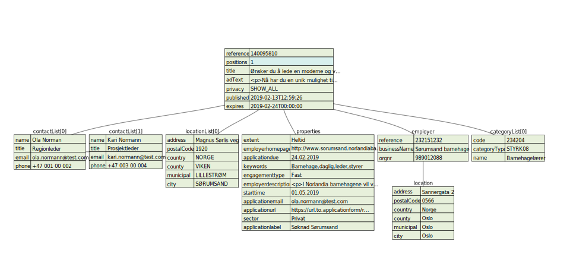

# Job Import API

## Introduction
With our job import API you will be able to upload and publish jobs to [arbeidsplassen.nav.no](https://arbeidsplassen.nav.no). 
Arbeidsplassen is a public job vacancy service provided by NAV, a place where you can search and apply for jobs in Norway. 
This API is designed as a lightweight REST API supporting requests with JSON over HTTP.

## Registration
Before you begin, you must register yourself as a job provider/partner. Please send your registration to this email with the 
following information:

* Provider/Company name
* Contact email
* Contact Phone

We will send you your provider identity including a secret key that gives you access to our API

## Authentication/Authorization
The API is not publicly open, all requests need to be authenticated using 
the HTTP bearer authorization header. 

Example:
```
POST https://tjenester-q0.nav.no/stillingsimport/api/v1/transfers/{providerId}
Accept: application/json
Cache-Control: no-cache
Content-Type: application/json
Authorization: Bearer <your secret key>
```

## Posting a job ad

To upload an ad, use HTTP POST as follow

```
POST https://tjenester-q0.nav.no/stillingsimport/api/v1/transfers/{providerId}
Accept: application/x-json-stream
Cache-Control: no-cache
Content-Type: application/x-json-stream
Authorization: Bearer <your secret key>

{
  "reference": "140095810",
  "positions": 1,
  "contactList": [
    {
      "name": "Ola Norman",
      "title": "Regionleder",
      "email": "ola.normann@test.com",
      "phone": "+47 001 00 002"
    },
    {
      "name": "Kari Normann",
      "title": "Prosjektleder",
      "email": "kari.normann@test.com",
      "phone": "+47 003 00 004"
    }
  ],
  "locationList": [
    {
      "address": "Magnus Sørlis veg",
      "postalCode": "1920",
      "country": "NORGE",
      "county": "VIKEN",
      "municipal": "LILLESTRØM",
      "city": "SØRUMSAND"
    }
  ],
  "properties": {
    "extent": "Heltid",
    "employerhomepage": "http://www.sorumsand.norlandiabarnehagene.no",
    "applicationdue": "24.02.2019",
    "keywords": "Barnehage,daglig,leder,styrer",
    "engagementtype": "Fast",
    "employerdescription": "<p>I Norlandia barnehagene vil vi være med å skape livslang lyst til lek og læring. Hos oss er barnets beste alltid i sentrum. Våre medarbeidere er Norlandias viktigste innsatsfaktor, og lederskap vårt viktigste suksesskriterium. Våre ledere er sterke og selvstendige med ansvar for å utvikle lederteam i barnehagene, og for å bidra aktivt inn i Ledergruppen i Regionen. Norlandia Sørumsand vil være tilknyttet Region Øst.</p>\n",
    "starttime": "01.05.2019",
    "applicationemail": "ola.normann@test.com",
    "applicationurl": "https://url.to.applicationform/recruitment/hire/input.action?adId=140095810",
    "sector": "Privat",
    "applicationlabel": "Søknad Sørumsand"
  },
  "title": "Ønsker du å lede en moderne og veletablert barnehage?",
  "adText": "<p>Nå har du en unik mulighet til å lede en godt faglig og veletablert barnehage. Norlandia Sørumsand barnehage ble etablert i 2006 og har moderne og fleksible oppholdsarealer. Barnehagens satsningsområder er Mat med Smak og Null mobbing i barnehagen.</p>\n<p><strong>Hovedansvarsområder:</strong></p>\n<ul><li>Drifte og utvikle egen barnehage i tråd med gjeldende forskrifter, bestemmelser og Norlandias overordnete strategi</li><li>Personalansvar</li><li>Overordnet faglig ansvar i egen barnehage</li><li>Bidra og medvirke i regionens endrings -og strategiprosesser</li><li>Kvalitet i barnehagen i henhold til konsernets kvalitets- og miljøpolicy</li></ul>\n<p><strong>Ønskede kvalifikasjoner:</strong></p>\n<ul><li>Barnehagelærerutdanning</li><li>Gode lederegenskaper</li><li>Engasjement for mat og miljø</li><li>Økonomiforståelse</li><li>Beslutningsdyktig, proaktiv og løsningsorientert</li><li>Effektiv og evnen til å håndtere flere oppgaver samtidig</li><li>Være motivator og støttespiller for medarbeiderne</li><li>Ha gode strategiske evner</li></ul>\n<p><strong>Vi tilbyr:</strong></p>\n<ul><li>Jobb i et sterkt fagmiljø i stadig utvikling, med et stort handlingsrom innenfor fastsatte rammer</li><li>Korte beslutningsveier og muligheter for personlig og faglig utvikling</li><li>Gode personalfasiliteter</li><li>Konkurransedyktig lønn og gode pensjonsbetingelser</li><li>Gyldig politiattest (ikke eldre enn 3 måneder ved tiltredelse) må fremvises før ansettelse</li></ul>\n<p><em><strong>Dette er en unik mulighet til å få lede en moderne veletablert barnehage.</strong></em></p>\n",
  "privacy": "SHOW_ALL",
  "published": "2019-02-13T12:59:26",
  "expires": "2019-02-24T00:00:00",
  "employer": {
    "reference": "232151232",
    "businessName": "Sørumsand barnehage",
    "orgnr": "989012088",
    "location": {
      "address": "Sannergata 2",
      "postalCode": "0566",
      "country": "Norge",
      "county": "Oslo",
      "municipal": "Oslo",
      "city": "Oslo"
    }
  },
  "categoryList": [
    {
      "code": "234204",
      "categoryType": "STYRK08",
      "name": "Barnehagelærer"
    }
  ]
}
```

If the request was successful you will get a response with a receipt:

```
{
  "versionId" : 1,
  "provider" : {
    "id" : 10000,
    "jwtid" : "test-key-id-1",
    "identifier" : "tester",
    "email" : "test@test.no",
    "phone" : "12345678"
  },
  "status" : "RECEIVED",
  "md5" : "3D5A0C23BC12D58D5865CF3CFC086F11",
  "items" : 1,
  "created" : "2020-04-02T09:47:58.52183",
  "updated" : "2020-04-02T09:47:58.521843"
}
```

### JSON Structure

The data format is JSON, below is a diagram of the json structure:

You can also download kotlin code for the DTOs 
[here](https://github.com/navikt/pam-import-api/blob/master/src/main/kotlin/no/nav/arbeidsplassen/importapi/dto/TransferDTO.kt)

#### Main properties
The main properties are required

|Name           | Type      | Required | Description                       | Example   |
|:------------- |:--------- |:-------- |:--------------------------------- |:------------    |
| reference     | String    | Yes      | A unique identifier for the jobAd | alfanumber eg. 140095810        |
| positions     | Integer   | Yes      | Amount of employment positions avaiable | 1         |
| title         | String    | Yes      | The main ad title | Ønsker du å lede en moderne og veletablert barnehage? |
| adText        | HTML      | Yes      | A describing text, html must be welformed. We only support basic html tags | Nå har du en unik mulighet til å lede en godt faglig og veletablert barnehage. Norlandia Sørumsand barnehage ble etablert i 2006 og har moderne og fleksible oppholdsarealer...|
| privacy       | ENUM      | Yes      | Controls what to be shown. | SHOW_ALL, INTERNAL_NOT_SHOWN, DONT_SHOW_EMPLOYER |
| published     | DATE      | Yes      | When to publish the ad | 2019-02-13T00:00:00 |
| expires       | DATE      | Yes      | Time of expiration | 2019-02-24T00:00:00 |

#### Employer
Arbeidsplassen uses [Brønnøysundregistrene](https://brreg.no) 
organization number to identify the employer (orgNr). If you are not able to send the orgNr, 
you must at least specify employer name, and postLocation, we also recommended you to use the "reference" field as a 
unique identifier for the employer, so that the employer can be mapped correctly next time it is used again.   

|Name | Type | Required | Description | Example |
|:----|:-----|:---------|:------------|:------|
|reference | String | Yes | A unique identifier for the employer | alfanumeric eg. 232151232 |
|businessName | String | Yes | Name of the employer | Sørumsand Barnehage |
|orgnr | Integer | Optional | BRREG. OrgNumber | 989012088
|location | Object | Yes | Address of the employer | See location table|

Location of Employer

|Name | Type | Required | Description | Example |
|:----|:-----|:---------|:------------|:------|
|address| String | Optional | Street address | Oslo gate 1|
|postalCode| String | Yes | Postal Code | 0566 |
|city | String | Optional | City | Oslo |
|municipal | String | Optional | Municipal | Oslo |
|county | String | Optional | County | Oslo |
|country | String | Optional | Country, defaults to Norge | Norge |

#### Category
Ads are classified by occupations, which use the international standard [STYRK-08](https://www.ssb.no/klass/klassifikasjoner/7) 
from SSB. You can download STYRK-categories from [here](https://tjenester-q0.nav.no/stillingsimport/api/v1/occupations/styrk08). 
It is possible to have more than two occupation categories for each ad. 
Though we don't recommend multi category ads, because it is less user friendly. 

|Name | Type | Required | Description | Example |
|:----|:-----|:---------|:------------|:------|
|code | String | yes | the code of occupation | 234204 |
| categoryType | ENUM | yes | type of occupation standard | STYRK08 |
| name | String | optional | name of category | Barnehagelærer |

If you don't support STYRK-occupations, 
please specify occupations using the "occupation" property (see below).

#### Optional Properties
An ad consists of many properties, they are all optional. However the more content the better the job ad will be. 
Some of these properties are indexed and so will make the ad easier to search for. 
Please specify as much data as possible on the property fields below.
 
|Name | Type | Required | Description | Example |
|:----|:-----|:---------|:------------|:------|
| sourceurl | URL | Optional | Optional viewing the jobad on another page | eg https://url.to/123456 |
| applicationdue | String | Optional | due date/time for job applications | 22.03.2020 |
| applicationemail | String | Optional | applications can be send to this email | apply-here@job.com |  
| applicationmail | String | Optional | Postal address for applications | Oslo gate 1, 0431 Oslo, Norge |
| applicationlabel | String | Optional | A tag for labelling applications | eg. referansenummer 312412 |
| applicationurl | String | Optional | URL to an online application form | https://url.to.application/form |
| employerdescription | HTML | Optional | A presentation about the employer, can be in html | I Norlandia barnehagene vil vi være med å skape livslang lyst til lek og læring...|
| employerhomepage | URL | Optional | URL to employer home page | https://url.to.homepage/ |
| engagementtype | String | Optional | type of employee engagement contract | eg. Fast or Engasjement etc. |
| extent | String | Optional | Full/Part time | Heltid |
| occupation | String | Optional | occupation types, separated by semicolon | eg. IT Utvikling; Java Utvikler |
| salary | Integer | Optional | Salary | 800000 |
| starttime | String | Optional | The start date or first day of work | eg. 24.05.2020 |
| sector | String | Optional | Public of private sector | Offentlig or Privat |
| location | String | Optional | the location of work, if address can not be given. also see locationList | eg. Hjemmekontor |
| jobtitle | String | Optional | title of position | eg. Kontorsjef |
| keywords | String | Optional | searchable tag keywords for the job ad, separated by semicolon | eg. 42312341;Javautvikler |
| industry | String | Optional | what kind of industry category this job belongs to | eg. Bygg og anlegg |
| workhours | String | Optional | what part of the day is work hours | eg. Dagtid |
| workday | String | Optional | Day of work | eg. Ukedager |
| facebookpage | String | Optional | facebook share URL | https://url.to.facebook/ |
| twitteraddress | String | Optional | twitter share URL | https://url.to.twitter/ |
| jobpercentage | String | Optional | if part time job, a percentage can be specified | eg 25% |
| jobarrangement | String | Optional | what type of jobarrangement | eg. Skift or Vakt |

#### Work Address/Location

Work location is the address/place of work. Ad must at least specify one work location, 
so that it shows up in a location search.

|Name | Type | Required | Description | Example |
|:----|:-----|:---------|:------------|:------|
| address | String | Optional | Street address | Magnus Sørlis veg. 1 |
| postalCode | String | Optional | postal/zip code | 1920 |
| county | String | Optional| County | Viken |
| municipal | String | Optional | Municipal | Lillestrøm |
| city | String | Optional | City | Sørumsand |
| country | String | Optional | defaults to Norge | Norge |


#### Contact information
Contact information can be specified in the contactList array property.
It is possible to have many contacts, we recommended at least one contact for each jobAd.

|Name | Type | Required | Description | Example |
|:----|:-----|:---------|:------------|:------|
| name | String | Yes | Contact name | Tom Doe |
| title | String | Optional | Job position title | Regionleder |
| email | String | Optional | Contact email | tom.doe@somewhere.com |
| phone | String | Optional | Phone number | +47 010 20 304 | 


#### Uploading using stream

#### Uploading in batches
You can choose to upload the ads in stream or in batches. If you have a lot of ads, more than thousands everyday.
We recommend you to upload in batches, You can group the ads in an array and send then in batches as follows:

### Receipt/Status

## Suggestions/Questions